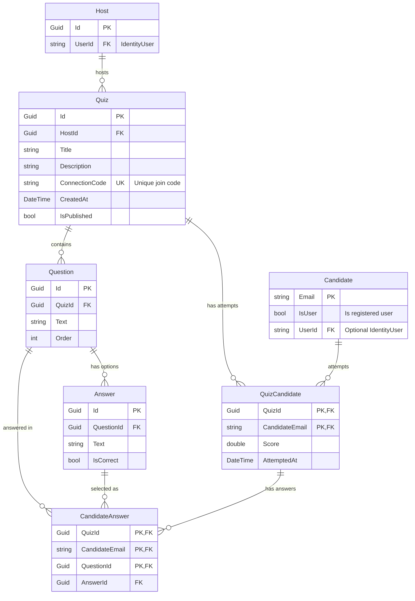

# quiz.hub

## Database Schema

```mermaid
erDiagram
    Host ||--o{ Quiz : hosts
    Quiz ||--o{ Question : contains
    Quiz ||--o{ QuizCandidate : "has attempts"
    Question ||--o{ Answer : "has options"
    Question ||--o{ CandidateAnswer : "answered in"
    Answer ||--o{ CandidateAnswer : "selected as"
    Candidate ||--o{ QuizCandidate : attempts
    QuizCandidate ||--o{ CandidateAnswer : "has answers"

    Host {
        Guid Id PK
        string UserId FK "IdentityUser"
    }

    Quiz {
        Guid Id PK
        Guid HostId FK
        string Title
        string Description
        string ConnectionCode UK "Unique join code"
        DateTime CreatedAt
        bool IsPublished
    }

    Question {
        Guid Id PK
        Guid QuizId FK
        string Text
        int Order
    }

    Answer {
        Guid Id PK
        Guid QuestionId FK
        string Text
        bool IsCorrect
    }

    Candidate {
        string Email PK
        bool IsUser "Is registered user"
        string UserId FK "Optional IdentityUser"
    }

    QuizCandidate {
        Guid QuizId PK,FK
        string CandidateEmail PK,FK
        double Score
        DateTime AttemptedAt
    }

    CandidateAnswer {
        Guid QuizId PK,FK
        string CandidateEmail PK,FK
        Guid QuestionId PK,FK
        Guid AnswerId FK
    }

```
